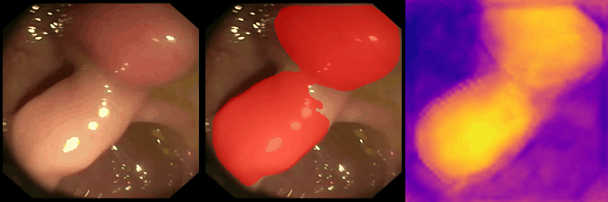
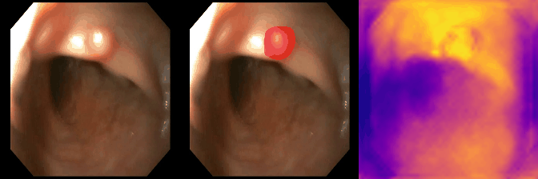
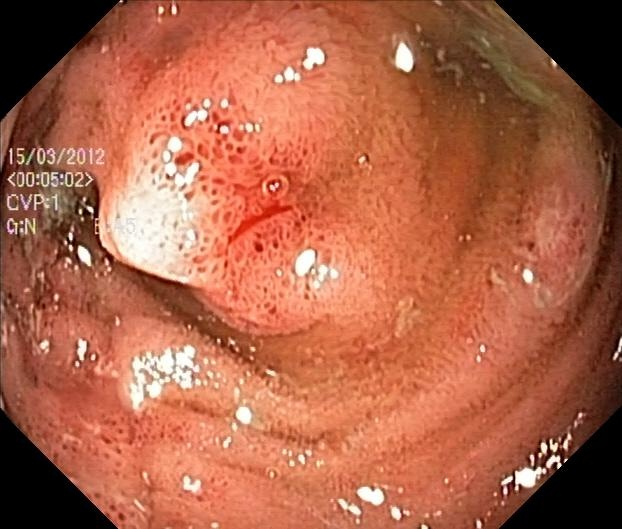
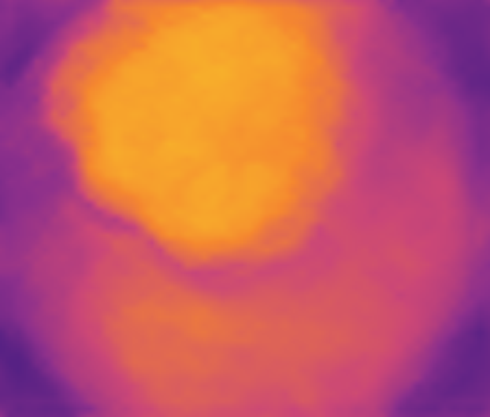
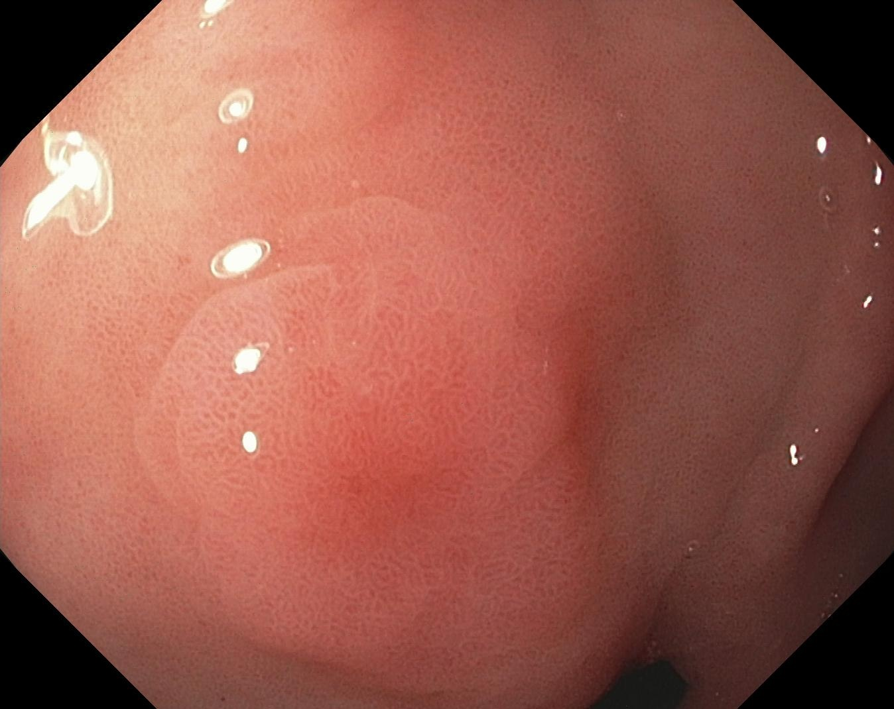
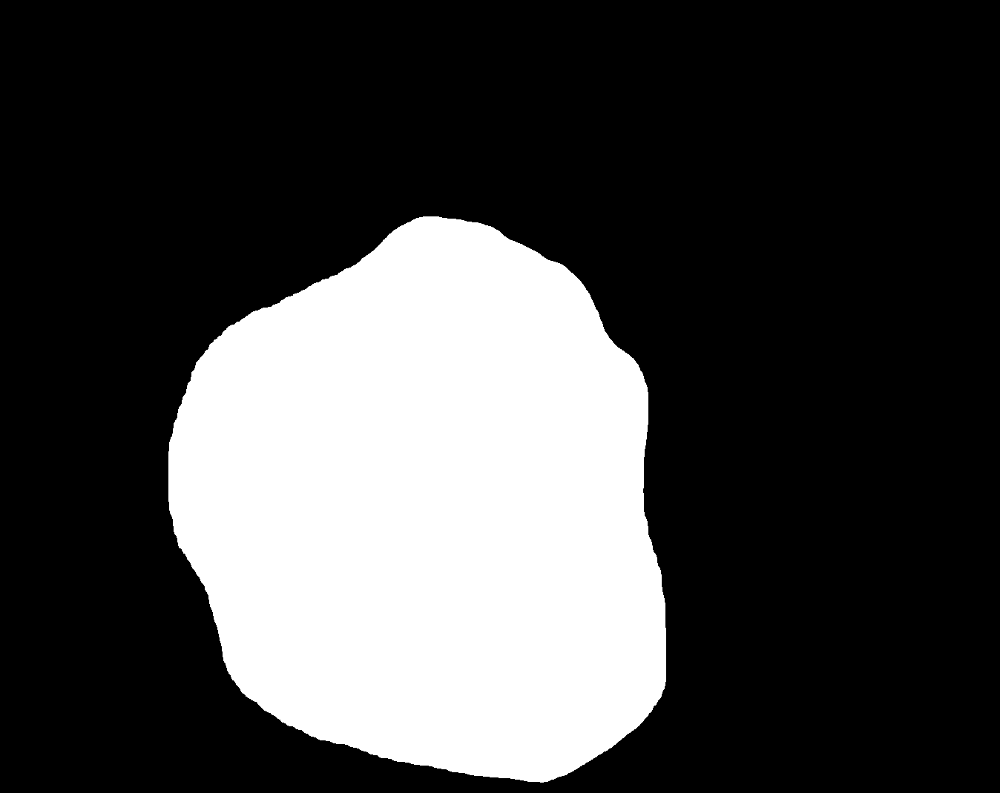
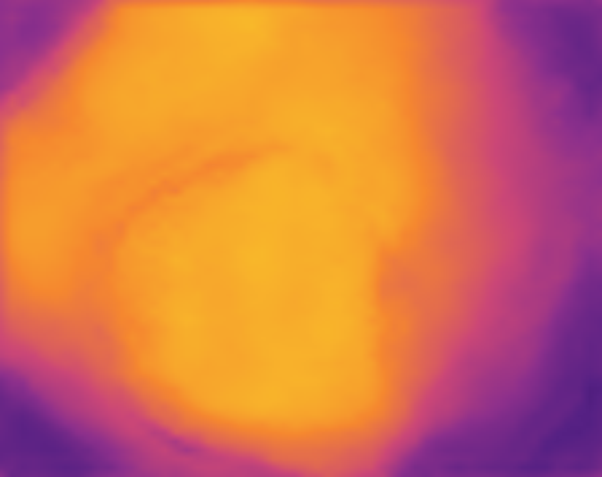
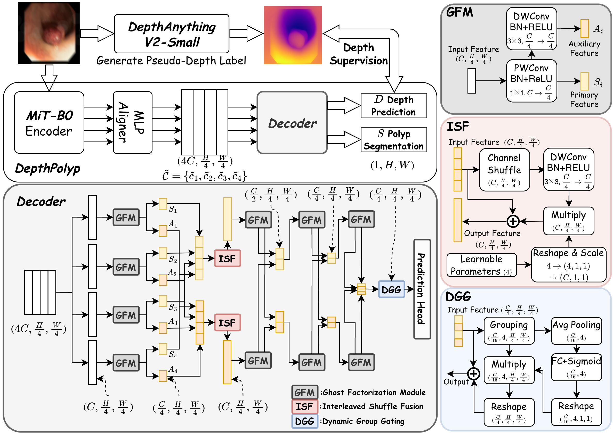

# DepthPolyp: Pseudo-Depth Guided Lightweight Segmentation for Real-Time Colonoscopy

[](#citation)
[](#checkpoint-and-onnx-artifacts)
[](LICENSE)

**Official PyTorch implementation of DepthPolyp (ICPR 2026)**

> **DepthPolyp: Pseudo-Depth Guided Lightweight Segmentation for Real-Time Colonoscopy**
>
> Zhuoyu Wu, Wenhui Ou, Lexi Zhang, Pei-Sze Tan, Dongjun Wu, Junhe Zhao, Wenqi Fang, and Raphaël C.-W. Phan

DepthPolyp is a pseudo-depth guided lightweight polyp segmentation model for practical colonoscopy deployment. Given a colonoscopy frame, the model jointly predicts:

1. a binary polyp segmentation mask
2. a pseudo-depth map for depth-aware structural guidance

The depth branch improves robustness under blur, noise, and real-world video degradation while keeping the model compact enough for edge-side inference.

## Qualitative results

PolypGen sequence examples:

<p align="center">
  
  
</p>

Kvasir sample outputs:

<p align="center">
  
  
  
</p>

<p align="center">
  
  
  
</p>

## Highlights

- Pseudo-depth guided segmentation for robust colonoscopy analysis
- Lightweight MiT-B0 based design with 3.57M parameters
- 0.86 GMACs at 224 x 224 input resolution
- Joint segmentation and depth prediction in one forward pass
- ONNX Runtime inference script for direct deployment checks
- Degradation-aware training for noisy and blurred endoscopic frames

DepthPolyp combines:

- **Ghost Factorization Module (GFM):** compact feature generation through pointwise and depthwise factorization
- **Interleaved Shuffle Fusion (ISF):** low-cost cross-scale channel interaction with deterministic shuffling
- **Dynamic Group Gating (DGG):** group-wise adaptive feature modulation for robust aggregation
- **Uncertainty-weighted multi-task learning:** automatic balancing between segmentation and pseudo-depth supervision

## Architecture

<p align="center">
  
</p>

Paper-reported reference numbers:

- Parameters: 3.57M
- Complexity: 0.86 GMACs
- Average Dice: 0.779 under the noisy evaluation protocol
- PolypGen Dice: 0.679
- iPhone FPS: 181.54
- Raspberry Pi 4 FPS: 4.05

## Installation

```bash
git clone https://github.com/ReaganWu/DepthPolyp.git
cd DepthPolyp

conda create -n depthpolyp python=3.10 -y
conda activate depthpolyp

pip install torch torchvision pillow numpy opencv-python albumentations tqdm
pip install onnx onnxruntime
```

## Data and training protocol

The paper trains on Kvasir-SEG and evaluates cross-domain generalization on CVC-ClinicDB, CVC-ColonDB, and PolypGen sequences 18-22.

| Dataset | Images | Usage | Characteristics |
| --- | ---: | --- | --- |
| Kvasir-SEG | 1,000 | Train and validation | high-quality polyp images |
| CVC-ClinicDB | 612 | OOD validation | cross-domain evaluation |
| CVC-ColonDB | 380 | OOD validation | diverse polyp appearances |
| PolypGen Seq. 18-22 | 273 | OOD validation | surgical blur and reflection artifacts |

Pseudo-depth targets are generated using Depth-Anything v2 Small and used only during training. They are not required at inference time.

Paper training settings:

- Input resolution: 224 x 224
- Encoder: MiT-B0
- Epochs: 200
- Optimizer: AdamW
- Learning rate: 1e-4
- Weight decay: 1e-4
- Batch size: 16 on NVIDIA A100
- Schedule: 10% warm-up followed by cosine annealing

Synthetic degradation settings used for robustness-oriented training and evaluation:

| Degradation | Parameters | Probability |
| --- | --- | ---: |
| Motion blur | kernel 3-29 px | 1.0 |
| Gaussian blur | sigma in {3, 5, 7} | 0.2 |
| Brightness | alpha in [-0.1, 0.2] | 1.0 |
| Contrast | beta in [-0.2, 0.2] | 1.0 |
| JPEG compression | quality 30-70 | 0.5 |
| Light spots / reflection | radius 5-40 px, intensity 0.85 | 0.8 |
| Fog | coefficient 0.5-0.8 | 0.3 |
| Optical distortion | distort / shift 0.05 | 0.3 |

## Checkpoint and ONNX artifacts

The release includes paper-aligned artifact names:

```text
checkpoints/DepthPolyp_Kvasir.pth
checkpoints/DepthPolyp_Kvasir.onnx
```

The names follow the public model description:

- DepthPolyp
- MiT-B0 encoder
- pseudo-depth guided segmentation
- Kvasir-SEG reference weights
- 224 x 224 input resolution

| Model | Format | Training data | Input | Notes |
| --- | --- | --- | --- | --- |
| `checkpoints/DepthPolyp_Kvasir.pth` | PyTorch | Kvasir-SEG with degradation-aware training | 224 x 224 | Released checkpoint |
| `checkpoints/DepthPolyp_Kvasir.onnx` | ONNX | Kvasir-SEG with degradation-aware training | 224 x 224 | Ready for ONNX Runtime |

ONNX I/O names:

```text
input:  image
outputs: segmentation, depth
```

## Quick inference

Run ONNX Runtime inference on the included Kvasir samples:

```bash
python scripts/infer_onnx.py \
  --onnx checkpoints/DepthPolyp_Kvasir.onnx \
  --input samples/kvasir/images \
  --output samples/kvasir/outputs
```

The script writes:

- `samples/kvasir/outputs/masks/*.png`: binary segmentation masks
- `samples/kvasir/outputs/depth/*.png`: purple-yellow pseudo-depth visualizations
- `samples/kvasir/outputs/overlay/*.jpg`: yellow mask overlays for quick inspection

Export the PyTorch checkpoint to ONNX:

```bash
python scripts/export_onnx.py \
  --checkpoint checkpoints/DepthPolyp_Kvasir.pth \
  --output checkpoints/DepthPolyp_Kvasir.onnx
```

## Model usage

```python
import torch
from PIL import Image
from torchvision import transforms

from model.depthpolyp import build_depthpolyp

device = "cuda" if torch.cuda.is_available() else "cpu"

model = build_depthpolyp(
    encoder_name="b0",
    in_channels=3,
    num_classes=2,
    decoder_channels=256,
    activation=None,
)

state_dict = torch.load(
    "checkpoints/DepthPolyp_Kvasir.pth",
    map_location="cpu",
    weights_only=True,
)
model.load_state_dict(state_dict, strict=True)
model.to(device).eval()

image = Image.open("samples/kvasir/images/sample_01.jpg").convert("RGB")
transform = transforms.Compose([
    transforms.Resize((224, 224)),
    transforms.ToTensor(),
])
x = transform(image).unsqueeze(0).to(device)

with torch.no_grad():
    seg_prob, depth_prob = model(x)

print(seg_prob.shape)    # [1, 1, 224, 224]
print(depth_prob.shape)  # [1, 1, 224, 224]
```

## Evaluation

We report the paper protocol as the primary benchmark. Models are trained on noisy Kvasir-SEG images and evaluated under clean (`N->C`) and noisy (`N->N`) test conditions.

The paper uses a four-quadrant robustness protocol:

- `Clean->Clean`: matched clean-domain performance
- `Clean->Noisy`: degradation generalization under distribution shift
- `Noisy->Clean`: clean-domain cost after degradation-aware training
- `Noisy->Noisy`: matched noisy-domain robustness

| Protocol | Kvasir Dice/IoU/Recall | ClinicDB Dice/IoU/Recall | ColonDB Dice/IoU/Recall |
| --- | --- | --- | --- |
| `N->C` | 0.891 / 0.805 / 0.885 | 0.854 / 0.748 / 0.845 | 0.801 / 0.669 / 0.759 |
| `N->N` | 0.853 / 0.745 / 0.854 | 0.751 / 0.608 / 0.759 | 0.734 / 0.582 / 0.697 |

Real-world robustness and deployment results from the paper:

| Params | GMACs | Avg. Dice | PolypGen Dice | iPhone FPS | RPi 4 FPS |
| ---: | ---: | ---: | ---: | ---: | ---: |
| 3.57M | 0.86 | 0.779 | 0.679 | 181.54 | 4.05 |

`Avg. Dice` is computed across Kvasir-SEG, CVC-ClinicDB, and CVC-ColonDB under the `N->N` protocol. PolypGen is evaluated on sequences 18-22, following the paper.

Representative deployment comparison:

| Model | Params | GMACs | Avg. Dice | PolypGen Dice | GPU FPS | iPhone FPS | RPi 4 FPS |
| --- | ---: | ---: | ---: | ---: | ---: | ---: | ---: |
| SegFormer-B0 | 3.71M | 1.30 | 0.714 | 0.634 | 84.14 | 186.72 | 4.12 |
| DepthPolyp | 3.57M | 0.86 | 0.779 | 0.679 | 79.12 | 181.54 | 4.05 |

## Ablation study

All variants are trained and evaluated under the `N->N` protocol. Average Dice and Recall are computed across Kvasir-SEG, CVC-ClinicDB, and CVC-ColonDB.

| Variant | Params | GMACs | Avg. Dice | Avg. Recall | iPhone FPS |
| --- | ---: | ---: | ---: | ---: | ---: |
| DepthPolyp full | 3.57M | 0.86 | 0.784 | 0.807 | 181.54 |
| w/o depth guidance | 3.57M | 0.86 | 0.759 | 0.789 | 181.54 |
| w/o uncertainty loss | 3.57M | 0.86 | 0.605 | 0.674 | 181.54 |
| w/o GFM | 3.73M | 1.36 | 0.776 | 0.798 | 131.39 |
| w/o ISF | 3.57M | 0.84 | 0.760 | 0.780 | 169.91 |
| w/o DGG | 3.57M | 0.86 | 0.736 | 0.752 | 147.87 |

For local evaluation checks:

```bash
python scripts/evaluate_depthpolyp.py \
  --weight checkpoints/DepthPolyp_Kvasir.pth \
  --datasets Kvasir Clinic Colon \
  --variants clean blur \
  --split all
```

## Repository structure

```text
DepthPolyp/
  model/
    depthpolyp.py       # DepthPolyp model definition
    modules/            # encoder, decoder, fusion, and head modules
  scripts/
    evaluate_depthpolyp.py
    export_onnx.py
    infer_onnx.py
  setup/                # data loading, losses, metrics, augmentation helpers
  checkpoints/          # released PyTorch and ONNX artifacts
  samples/kvasir/       # two sample Kvasir images and example outputs
  assets/               # README GIFs and qualitative examples
  main.py               # training entry point
  trainer.py            # training loop utilities
```

## Citation

```bibtex
@inproceedings{wu2026depthpolyp,
  title={DepthPolyp: Pseudo-Depth Guided Lightweight Segmentation for Real-Time Colonoscopy},
  author={Wu, Zhuoyu and Ou, Wenhui and Zhang, Lexi and Tan, Pei-Sze and Wu, Dongjun and Zhao, Junhe and Fang, Wenqi and Phan, Rapha{\"e}l C.-W.},
  booktitle={International Conference on Pattern Recognition},
  year={2026}
}
```

## Acknowledgements

This release follows the public repository style of [EndoCaver](https://github.com/ReaganWu/EndoCaver) and [RT-Focuser](https://github.com/ReaganWu/RT-Focuser). Thanks to the public polyp segmentation datasets used by the community.

## License

This project is released under the MIT License. See `LICENSE`.
